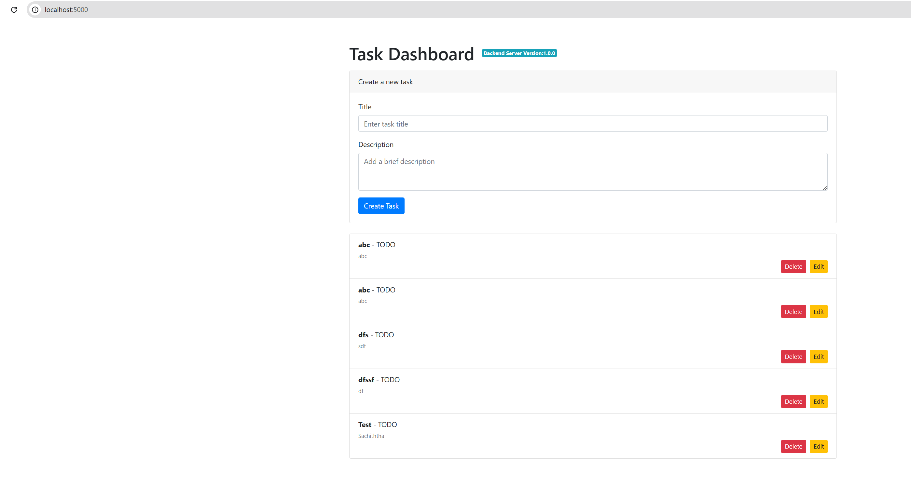

# Frontend — Task Dashboard

Part of the [dsti-devops suite](https://github.com/sacumesh/dsti-devops). This repository provides the web frontend for the Task Dashboard.



## Technology Stack
- Python
- Flask
- Containerization: Docker

## Features
- Web dashboard for managing tasks
- Integrates with a backend REST API
- Displays task title, status, and description

## Endpoints
| Method | Endpoint  | Description           |
| ------ | --------- | --------------------- |
| GET    | `/`       | Task dashboard UI     |
| GET    | `/health` | Frontend health check |

## Running the application

### Backend setup
Use the included Docker Compose file to provision the backend (MariaDB and the Task Manager API):
```bash
docker compose -f docker-compose-backend.yaml up -d
```
For manual backend setup, see: https://github.com/sacumesh/devops-task-manager

### Configuration
Defaults (from docker-compose-backend.yaml). Override via environment variables or a .env file:
```bash
export SERVER_PORT=5000
export MANAGER_HOST=localhost
export MANAGER_PORT=8080
```

### Run locally
1) Install Python dependencies:
```bash
pip install -r requirements.txt
```

2) Start the frontend:
```bash
cd src
python main.py
```

The frontend will listen on http://localhost:5000 and connect to the backend at MANAGER_HOST:MANAGER_PORT (default http://localhost:8080).


## CI/CD

### GitHub Actions
- Branches: `develop`, `main`
- Triggers:
    - On push or pull request:
        - Build Docker image (no tests)
    - Manual (`workflow_dispatch`):
        - Input: tag (e.g., `v1.2.0`)
        - Login using GitHub Secrets
        - Build and push to Docker Hub

### References
- Workflows: https://github.com/sacumesh/devops-task-dashboard/tree/main/.github/workflows
- Docker Hub: https://hub.docker.com/layers/sacumesh/devops-task-dashboard/1.0.0

## Docker
```bash
docker build --no-cache -t <your-namespace>/<your-repo>:<tag> .
```
